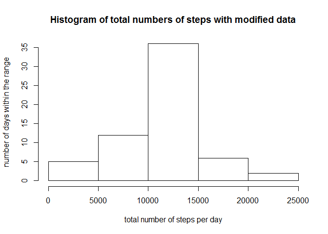

# Reproducible Research: Peer Assessment 1
## Loading and preprocessing the data
First, the csv file is read and a first preprocess is done.

```r
library(data.table)
library(chron)
library(ggplot2)
library(plyr)

setwd("activity")
data <- read.csv("activity.csv")
dataDF <- data.frame(data)
```
## What is mean total number of steps taken per day?
The data is first summarized to calculate the number of steps per day. Then the histogram is ploted with adjusted namings.

```r
stepsPerDay <- tapply(data$steps, data$date, FUN=sum)
hist(stepsPerDay,  main = "Histogram of total numbers of steps",ylab="number of days within the range", xlab="total number of steps per day")
```

 
The mean of the total number of steps taken per day is computed as follows.

```r
stepsPerDayDF <- data.frame(stepsPerDay)
mean <- colMeans(stepsPerDayDF, na.rm = TRUE)
mean
```

```
## stepsPerDay 
##    10766.19
```
The median of the total number of steps taken per day is computed as follows.

```r
median <- median(stepsPerDayDF$stepsPerDay, na.rm = TRUE)
median
```

```
## [1] 10765
```

## What is the average daily activity pattern?
First, all the rows with NA are removed. Then, the average steps per 5 minutes are evaluated and the 5 minute intervalls are represented in minutes (24hours = 1440 minutes).

```r
cleanData <- data[complete.cases(data),]
averageSteps <- tapply(cleanData$steps, cleanData$interval, FUN=mean)
dataForPlot = cbind(seq(0,1435 , 5),averageSteps)
```

And here comes the plot.

```r
plot(dataForPlot, type= "l", xlab="One day in minutes", ylab="average steps per 5minutes")
```

 

Finding the time with the maximum numbers of steps:

```r
dataMax <- data.frame(dataForPlot)
searchedInterval <- dataMax[which.max(dataMax$averageSteps),1]
cat("The 5 minute intervall with the maximal number of steps starts at ", searchedInterval%/%60,":",searchedInterval%%60)
```

```
## The 5 minute intervall with the maximal number of steps starts at  8 : 35
```

## Imputing missing values
First, the number of rows containing a NA is given:


```r
sum(is.na(dataDF$steps))
```

```
## [1] 2304
```

Now comes a rather complicated way to assign the average of a given time intervall to an NA value.

```r
index <- is.na(dataDF$steps)
averageDF <- data.frame(averageSteps)
setDT(averageDF, keep.rownames = TRUE)
invisible(transform(averageDF, rn = as.numeric(rn)))
newDF<- dataDF
newDF$steps[index] <- averageDF[averageDF$rn == newDF$interval[index]]$averageSteps
# replace all the na values, this is just a hacki way to do it. a while loop would be better...
index2 <- is.na(newDF$steps)
newDF$steps[index2] <- averageDF[averageDF$rn == newDF$interval[index2]]$averageSteps
index3 <- is.na(newDF$steps)
newDF$steps[index3] <- averageDF[averageDF$rn == newDF$interval[index3]]$averageSteps
index4 <- is.na(newDF$steps)
newDF$steps[index4] <- averageDF[averageDF$rn == newDF$interval[index4]]$averageSteps
index5 <- is.na(newDF$steps)
newDF$steps[index5] <- averageDF[averageDF$rn == newDF$interval[index5]]$averageSteps
index6 <- is.na(newDF$steps)
newDF$steps[index6] <- averageDF[averageDF$rn == newDF$interval[index6]]$averageSteps
index7 <- is.na(newDF$steps)
newDF$steps[index7] <- averageDF[averageDF$rn == newDF$interval[index7]]$averageSteps
index8 <- is.na(newDF$steps)
newDF$steps[index8] <- averageDF[averageDF$rn == newDF$interval[index8]]$averageSteps
```

Here comes the histogram

```r
stepsNewDF<- tapply(newDF$steps, newDF$date, FUN=sum)
hist(stepsNewDF,  main = "Histogram of total numbers of steps with modified data",ylab="number of days within the range", xlab="total number of steps per day")
```

 

Computation of the new mean:

```r
stepsNewDF <- data.frame(stepsNewDF)
newMean<- colMeans(stepsNewDF, na.rm = TRUE)
```
Computation of the new median:

```r
newMedian <- median(stepsNewDF$stepsNewDF, na.rm = TRUE)
```

And here both given in comparrison with the initially computed mean and median.

```r
c(mean,newMean)
```

```
## stepsPerDay  stepsNewDF 
##    10766.19    10766.19
```

```r
c(median,newMedian)
```

```
## [1] 10765.00 10766.19
```

Since we replaced the NAs with the mean values, the mean is preserved. But the median differs slightly, since the median and the mean are very close but not equal, the oparation of replacing NAs did affect the median. 


## Are there differences in activity patterns between weekdays and weekends?

Creating a factor variable.

```r
newDF$workwe <- ifelse(is.weekend(as.Date(newDF$date)), "weekend","weekday" )
newDF <- transform(newDF,workwe =factor(workwe))
```
And the plot that distinguishes weekend and weekdays.

```r
qplot(interval, steps, data = newDF,stat = "summary", fun.y = "mean", facets = workwe~., main="average weekday weekend", ylab="Number of steps",geom = "line")
```

 
